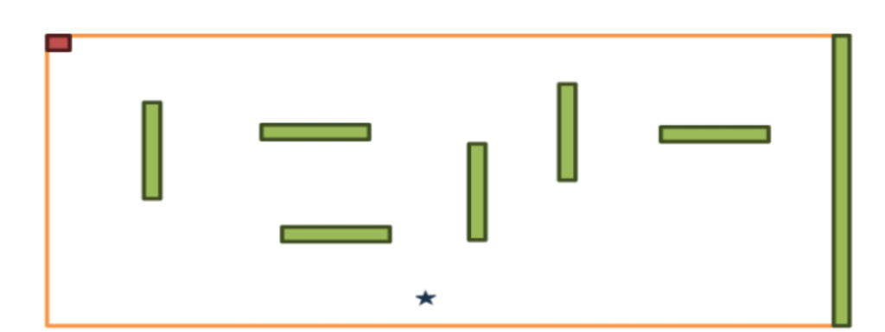

<h1 align="center">⭐ MovingStar</h1>

<p align="center">
  
  
  
  
</p>

<p align="center">
  A real-time obstacle-navigation game written entirely in <strong>8088 Assembly Language</strong>. Control a moving star through a maze of obstacles to reach the goal — all at the hardware level, with custom keyboard and timer interrupt handlers.
</p>

<p align="center">
  
</p>

---

## 🎮 Gameplay

- **`★`** — You are the moving star (`*`)
- **`■`** — Green blocks are obstacles (avoid them!)
- **`■`** — Red block is the goal (reach it to win!)
- The star moves automatically and bounces off screen edges
- Use **arrow keys** to change the star's direction in real time
- Hit an obstacle → **Game Over**
- Reach the red goal → **You Win!**

---

## 🕹️ Controls

| Key | Action |
|---|---|
| `↑` Arrow | Move Up |
| `↓` Arrow | Move Down |
| `←` Arrow | Move Left |
| `→` Arrow | Move Right |
| `Space` | Start Game |
| `ESC` | Quit |

---

## ✨ Features

- 🧠 **Direct Hardware Control** — writes directly to video memory at `0xB800`
- ⌨️ **Keyboard ISR Hooking** — custom interrupt 9 handler for real-time key input
- ⏱️ **Timer ISR Hooking** — custom interrupt 8 handler drives the game loop at 2 ticks/move
- 🏗️ **Obstacle System** — 7 hand-crafted horizontal and vertical obstacles placed via direct memory writes
- 💥 **Collision Detection** — reads video memory to detect obstacle and goal collisions
- 🔄 **Edge Bouncing** — star automatically bounces off left, top, and bottom screen edges
- 🖥️ **Screen Management** — start screen, win screen, loss screen, and exit screen

---

## 🏗️ Project Structure

```
MovingStar/
├── project.asm      # Full source code — game logic, ISR hooks, screen rendering
├── PROJECT.COM      # Assembled DOS executable — run directly in DOSBox
├── nasm.exe         # NASM assembler (DOS) — used to assemble the source
└── AFD.EXE          # Advanced Full-screen Debugger — for stepping through assembly
```

---

## 🛠️ Tech Stack

| Component | Detail |
|---|---|
| **Language** | 8088 Assembly (x86 real mode) |
| **Assembler** | NASM |
| **Output** | DOS `.COM` executable |
| **Video** | Direct VGA text-mode memory write (`0xB800`) |
| **Input** | Hardware Interrupt 9 (keyboard) |
| **Timing** | Hardware Interrupt 8 (timer) |

---

## 🚀 Running the Game

### Using DOSBox (recommended for modern systems)

```bash
# 1. Install DOSBox
brew install dosbox        # macOS
sudo apt install dosbox    # Linux

# 2. Mount the project folder and run
dosbox -c "mount c /path/to/MovingStar" -c "c:" -c "PROJECT.COM"
```

### Assembling from Source

A copy of NASM is included in the repo for convenience:

```bash
# Using the included NASM (inside DOSBox)
nasm -f bin project.asm -o PROJECT.COM
```

### Debugging with AFD

AFD (Advanced Full-screen Debugger) is included for stepping through the assembly:

```bash
# Inside DOSBox
AFD PROJECT.COM
```

---

## 🧠 How It Works

The game hooks into two hardware interrupts:

1. **INT 8 (Timer)** — fires ~18.2 times/second. Every 2 ticks, `move_player` is called to advance the star and check collisions.
2. **INT 9 (Keyboard)** — fires on every keypress. Reads the scan code from port `0x60` and updates the direction variable.

Both ISRs save all registers, perform their work, and chain to the original ISR — ensuring the system stays stable. On exit, both are unhooked and the original ISRs are restored.

---

## 📄 License

This project is open source and available under the [MIT License](LICENSE).
